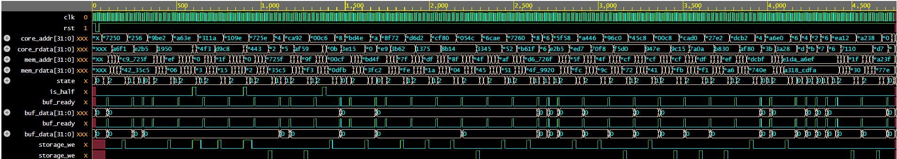

# RISC-V L1 Instruction Cache Controller

A synthesizable 2-Way Set Associative L1 Instruction Cache Controller designed for RISC-V processor cores[cite: 2, 3]. The module provides hardware support for compressed instruction fetching (RVC Extension)[cite: 2] and integrates with the system bus via an AMBA AHB-Lite compatible interface[cite: 2].

## Project Architecture

The project is implemented in SystemVerilog and features a modular design[cite: 2, 3]:
*   **`cache_ctrl.sv`** — The central control Finite State Machine (FSM) that coordinates cache hit/miss logic, line replacement policy, and main memory transactions[cite: 2, 3].
*   **`pre_access_buffer.sv`** — A specialized pre-access buffer designed to dynamically assemble unaligned 32-bit instructions spanning across two adjacent cache lines[cite: 2, 3, 4].
*   **`cache_storage.sv`** — A synchronous Tag/Data RAM array that stores cached instructions and tags separately for each channel (Way 0 / Way 1)[cite: 3, 5, 6].
*   **`interfaces.sv`** — Strongly typed interfaces defining the signaling bundles between the core, cache components, and external memory[cite: 2, 5].
*   **`top_module.sv`** — The top-level structural module that instantiates and connects the controller, pre-access buffers, and storage blocks[cite: 3].

### Key Features
*   **RISC-V RVC Support:** The processor can issue requests for both standard 32-bit and compressed 16-bit instructions[cite: 2, 4]. The control FSM transparently handles edge cases where a 32-bit instruction is split between the end of one cache line and the start of the next[cite: 2, 4].
*   **Replacement Policy:** Employs a Pseudo-LRU replacement algorithm utilizing a tracking array (`last_access`) to determine which line to evict during a cache miss[cite: 2].
*   **Bus Interface:** Main memory handshakes follow the AHB-Lite specification guidelines using standard burst controls (`h_trans`, `mem_ready`, `mem_valid`)[cite: 2, 5].

---

## Verification (OOP Testbench)

A robust object-oriented verification environment (SV OOP TB) was built to validate the FSM routing and unaligned access scenarios[cite: 2, 7, 8]:
*   **`tb_transaction.sv`** — Constrained-random transaction class generating half-word aligned instruction addresses with targeted split-transaction and cache eviction distribution[cite: 7, 10, 11].
*   **`tb_cache_driver.sv`** — Simulates the instruction fetch behavior of a processing core[cite: 8, 10].
*   **`tb_cache_mem_model.sv`** — An associative memory array acting as an AHB-Lite Responder to handle line fills[cite: 8, 9].
*   **`tb_cache_checker.sv`** — A dynamic Scoreboard monitoring hardware outputs and validating them against an internal reference model[cite: 7, 8].
*   **`tb_test.sv`** — Orchestrates the testbench component execution[cite: 8].

---

## Waveforms

Below is a hardware timing diagram captured during simulation, illustrating the behavior of the cache controller:

Key behavioral milestones visible in the waveform include:
*   The primary control FSM state transitions (`state`: `IDLE` $\rightarrow$ `CACHE_CHECK` $\rightarrow$ `AHB_DATA`)[cite: 1, 2].
*   Edge detection and handshaking using memory validation lines (`buf_ready`)[cite: 1, 2].
*   Latching of input CPU addresses (`core_addr`) and line-aligned memory address generation (`mem_addr`) upon detecting a cache miss[cite: 1, 2].
*   Strobe assertions for cache array updates (`storage_we`) as the line fill completes data buffering[cite: 1, 2].
